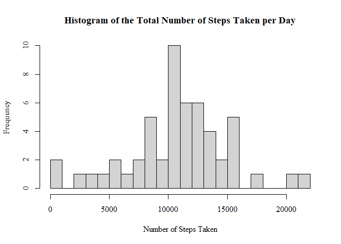
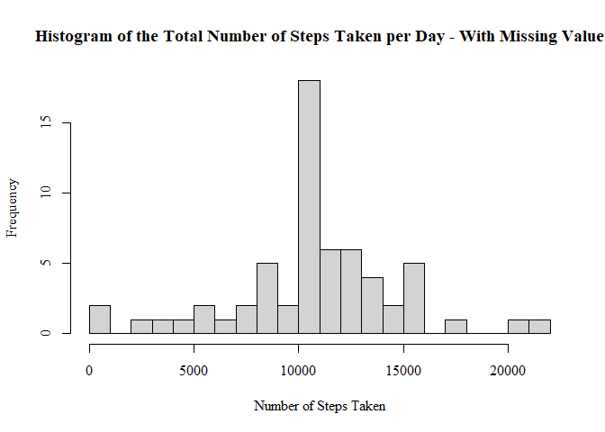
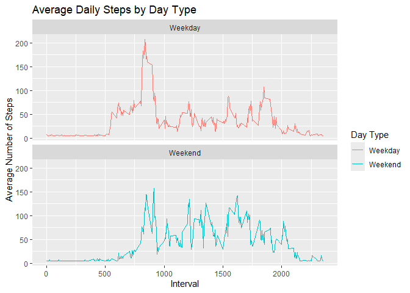

This is the submission of peer-reviewed project 1 for Reproducible research via Coursera.

Setting golbal options:

``` r
knitr::opts_chunk$set(echo = TRUE)
```
## Loading and preprocessing the data
First, we need to load the dataset.

``` r
unzip("activity.zip")
data <- read.csv("activity.csv",colClasses=c("numeric", "Date", "numeric"))
```

Then, we need to get an overview of the dataset.


``` r
summary(data)
```

```
##      steps             date               interval     
##  Min.   :  0.00   Min.   :2012-10-01   Min.   :   0.0  
##  1st Qu.:  0.00   1st Qu.:2012-10-16   1st Qu.: 588.8  
##  Median :  0.00   Median :2012-10-31   Median :1177.5  
##  Mean   : 37.38   Mean   :2012-10-31   Mean   :1177.5  
##  3rd Qu.: 12.00   3rd Qu.:2012-11-15   3rd Qu.:1766.2  
##  Max.   :806.00   Max.   :2012-11-30   Max.   :2355.0  
##  NA's   :2304
```
From the results, we can see that there are 2304 pieces of data-[Steps] being NAs.


## What is mean total number of steps taken per day?

The instructions said we can ignore the missing values in the dataset.


``` r
data2 <- data[!(is.na(data$steps)),]
```

Then, we need to calculate the total number of steps taken per day.


``` r
total_steps <- aggregate(steps ~ date, data2, sum)
```

The third step is to make a histogram of the total number of steps taken each day.


``` r
hist(total_steps$steps, breaks=20, xlab="Number of Steps Taken", 
     main="Histogram of the Total Number of Steps Taken per Day",
     family="serif")
```

<!-- -->
The last request for task 2 is to calculte the mean and median of the total number of steps taken each day.


``` r
data2_meansteps <- mean(total_steps$steps)
data2_mediansteps <- median(total_steps$steps)
```
As a result, the mean value and the median value of the of the total number of steps taken each day are respectively 1.0766189\times 10^{4} and 1.0765\times 10^{4}.

## What is the average daily activity pattern?
The first step is to make a time series plot (i.e. type = "l") of the 5-minute interval (x-axis) and the average number of steps taken, averaged across all days (y-axis)


``` r
averageStepsbyInterval<-aggregate(steps~interval, data2, mean)
head(averageStepsbyInterval)
```

```
##   interval     steps
## 1        0 1.7169811
## 2        5 0.3396226
## 3       10 0.1320755
## 4       15 0.1509434
## 5       20 0.0754717
## 6       25 2.0943396
```

``` r
with(averageStepsbyInterval, plot(interval, steps, type = "l"))
```

<!-- -->
Then, we need to figure out the question: which 5-minute interval, on average across all the days in the dataset, contains the maximum number of steps?


``` r
averageStepsbyInterval[which.max(averageStepsbyInterval[,2]),1]
```

```
## [1] 835
```
## Imputing missing values
Firstly, we need to calculate how many NAs in the raw data.


``` r
missingflag <- is.na(data$steps)
Number_NAs <- sum(missingflag)
```
Therefore, there are 2304 NAs in the raw dataset.

Then we need to imputing missing values. I have decided to fill in all of the missing values in the dataset by the mean number of steps per interval. The head of the new filled dataset is as following:


``` r
m4NAs<-mean(averageStepsbyInterval$steps)
newdata <- data
newdata[missingflag,1] <- m4NAs
head(newdata)
```

```
##     steps       date interval
## 1 37.3826 2012-10-01        0
## 2 37.3826 2012-10-01        5
## 3 37.3826 2012-10-01       10
## 4 37.3826 2012-10-01       15
## 5 37.3826 2012-10-01       20
## 6 37.3826 2012-10-01       25
```

The second last step is to compute the total number of steps, make a hist fiture, and to compute the mean and median total number of steps taken per day. 

``` r
new_total_steps <- aggregate(steps ~ date, newdata, sum)

hist(new_total_steps$steps, breaks=20, xlab="Number of Steps Taken", 
     main="Histogram of the Total Number of Steps Taken per Day - With Missing Value",
     family="serif")
```

<!-- -->

``` r
newdata_meansteps <- mean(new_total_steps$steps)
newdata_mediansteps <- median(new_total_steps$steps)
```

As a result, the mean value and the medipn value of the of the total number of steps taken each day are respectively 1.0766189\times 10^{4} and 1.0766189\times 10^{4}.

Lastly, we need to compare the values with those in question 1.

``` r
cat(
      "Mean for question 1: ", data2_meansteps, 
      "\nMedian for question 1: ",data2_mediansteps,
      "\nMean for data with missing values: ",newdata_meansteps,
      "\nMedian for data with missing values: ",newdata_mediansteps
)
```

```
## Mean for question 1:  10766.19 
## Median for question 1:  10765 
## Mean for data with missing values:  10766.19 
## Median for data with missing values:  10766.19
```
Also, we can see from the figure that the mean value for both dataset is the same. However, the median values with added missing values are a little bit higher than the one without missing values.

## Are there differences in activity patterns between weekdays and weekends?

According to the question, we need an annotation to flag if the day is weekday.


``` r
Sys.setlocale("LC_TIME","en_US")
```

```
## [1] "en_US"
```

``` r
newdata$date <- as.Date(strptime(newdata$date, format="%Y-%m-%d"))
newdata$dayflag <- sapply(newdata$date, function(x) {
  if(weekdays(x) == "Saturday" | weekdays(x) == "Sunday")
  {y <- "Weekend"}
  else {y <- "Weekday"}
  y
})
```

Then, we need to make a panel plot containing a time series plot (i.e. type = "l") of the 5-minute interval (x-axis) and the average number of steps taken, averaged across all weekday days or weekend days (y-axis)


``` r
new_averageStepsbyInterval <-  aggregate(steps ~ interval + dayflag, newdata, mean, na.rm = TRUE)
library(ggplot2)
```

```
## Warning: package 'ggplot2' was built under R version 4.4.1
```

``` r
PlotbyDay <- ggplot (new_averageStepsbyInterval, aes(x = interval , y = steps, color = dayflag)) + 
  geom_line() + ggtitle("Average Daily Steps by Day Type") + 
  xlab("Interval") + 
  ylab("Average Number of Steps") +
  facet_wrap(~dayflag, ncol = 1, nrow=2) +
  scale_color_discrete(name = "Day Type") 

print(PlotbyDay)
```

<!-- -->
